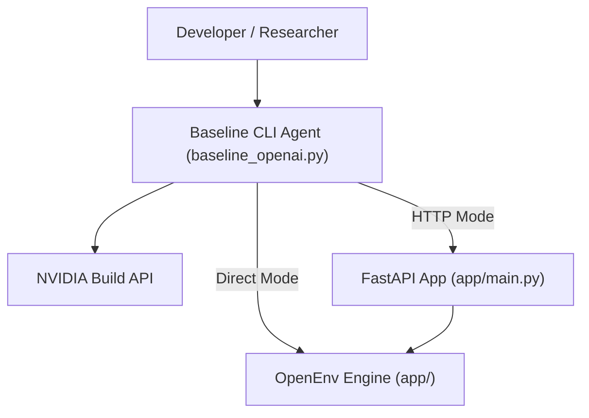

# OPENENV_RL: Gov Workflow Optimization

OPENENV_RL is a high-fidelity reinforcement learning (RL) simulation environment designed to model and optimize government district office workflows. It features a sophisticated LLM-driven agent system with a 10-model fallback sequence for maximum resilience and production stability.

---

## 🏛️ System Architecture

The application is built on a decoupled architecture, allowing for local execution ("Direct Mode") or distributed evaluation via a FastAPI backend ("HTTP Mode").

### System Context Diagram


### LLM Orchestration & Resilience
To prevent simulation crashes due to API rate limits (429) or endpoint deprecation (404), the system implements a **Cyclic 10-Model Fallback Sequence**.

```mermaid
state_machine
    [*] --> PrimaryModel
    PrimaryModel --> Success: "200 OK"
    PrimaryModel --> Failure: "429 / 404 / 403"
    Failure --> ModelRotator: "Immediate Failover"
    ModelRotator --> NextModel: "Rotate (Cyclic)"
    NextModel --> PrimaryModel: "Re-execute Step"
    Success --> [*]
```

#### The 10-Model Sequence:
1.  **meta/llama-3.3-70b-instruct** (Primary)
2.  **qwen/qwen3-next-80b-a3b-instruct** (Reasoning)
3.  **moonshotai/kimi-k2-instruct-0905** (Planning)
4.  **meta/llama-3.1-405b-instruct** (Max Capacity)
5.  **deepseek-ai/deepseek-v3.2** (High Performance)
6.  **qwen/qwq-32b** (Deep Thinking)
7.  **mistralai/mixtral-8x22b-instruct-v0.1** (Fast MoE)
8.  **google/gemma-3-27b-it** (Lightweight)
9.  **microsoft/phi-4-mini-instruct** (Last Resort)
10. **meta/llama-3.1-8b-instruct** (Safety Fallback)

---

## 🚀 Getting Started

### 1. Prerequisites
- Python 3.10+
- An NVIDIA Build API Key ([Get one here](https://build.nvidia.com/))

### 2. Environment Setup
Clone the repository and install the dependencies:
```powershell
pip install -r requirements.txt
```

Create a `.env` file in the root directory (refer to `.env.example`):
```ini
NVIDIA_API_KEY=nvapi-xxxxxxxxxxxx
NVIDIA_API_KEY_2=nvapi-yyyyyyyyyyyy  # Optional (Free tier pool)
LLM_CALL_DELAY=12.0                  # Rate-limiting throttle (seconds)
```

### 3. Verification
Before running a full benchmark, verify your connectivity:
```powershell
python tests/test_10_models.py
```

---

## 🛠️ Running the Application

### Option A: Local Baseline (CLI)
Calculates everything in-process. Fastest for immediate research.
```powershell
python baseline_openai.py --agent llm --task all --verbose --save-results
```

### Option B: Remote Server (HTTP)
Starts a FastAPI server to host the environment and accepts connections from remote agents.

**Start the Server:**
```powershell
uvicorn app.main:app --host 0.0.0.0 --port 7860 --reload
```

**Connect the Agent:**
```powershell
python baseline_openai.py --mode http --url http://localhost:7860 --agent llm --task district_backlog_easy
```

---

## 📊 Core Components

| Component | Responsibility |
| :--- | :--- |
| **`app/env.py`** | Implementation of the `OpenEnv` gym-like environment. |
| **`app/state_machine.py`** | Logic for application arrivals and stage transitions. |
| **`app/reward.py`** | Mathematical modeling of SLA penalties and progress rewards. |
| **`app/graders.py`** | Complex evaluation logic for multi-dimensional performance (Fairness, Efficiency). |
| **`baseline_openai.py`** | The main agent loop with Pydantic normalization and automatic rotation. |

---

## 📝 Performance Reporting
Every simulation run generates a detailed report including:
- **Episode Score**: Scaled 0.0 to 1.0.
- **SLA Compliance**: Percentage of cases completed within deadline.
- **Model Performance Use**: A specific tally of how many steps each model in the fallback sequence contributed.

Example Report:
> `[cross_department_hard] agent=llm score=0.649 reward=65.94 completed=54 branches=89 invalid=0 rotations=1`
> `Model Performance Use: meta/llama-3.3-70b-instruct (8 steps), qwen/qwen3-next-80b-a3b-instruct (64 steps)`

---

## ⚠️ Important Notes
- **Rate-Limiting**: The NVIDIA free tier allows ~5 RPM. The script is hard-coded to sleep ~12s between calls. 
- **Case Sensitivity**: Model IDs and Enum values are case-sensitive. The `_extract_json_action` utility handles normalization automatically.

---

*This application was developed to push the boundaries of agentic resiliency in complex simulation environments.*
