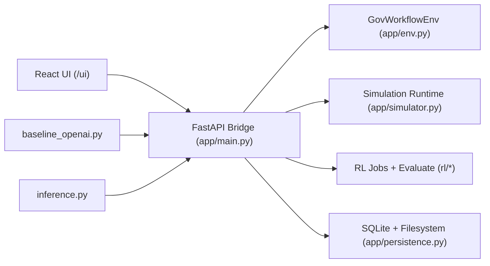
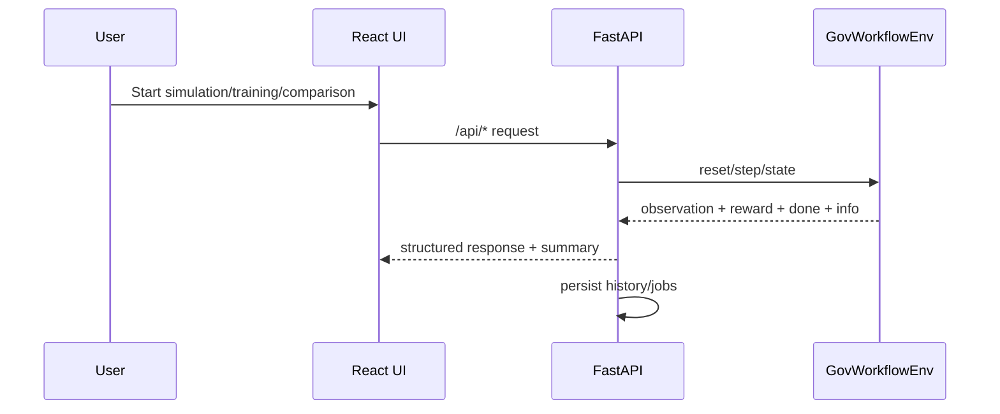

# Gov Workflow OpenEnv

Real-world OpenEnv environment for government-service workflow optimization, with a full FastAPI bridge, RL training stack, and React operations UI.

## What This Application Is

This project simulates a real administrative workload that humans perform in district/public-service offices:

- queue prioritization
- officer allocation and reallocation
- missing document follow-up
- escalation budget management
- SLA/fairness balancing

Agents interact through OpenEnv-style APIs (`reset / step / state / grade`) and can be evaluated with deterministic graders.

## Current Module Architecture





## OpenEnv Compliance

OpenEnv manifest:

- `openenv.yaml`

Typed Pydantic models (core contract):

- `ActionModel`
- `ObservationModel`
- `RewardModel`
- `StepInfoModel`
- `EpisodeStateModel`

Files:

- `app/models.py`
- `app/env.py`
- `app/main.py`

Environment endpoints:

- `POST /reset`
- `POST /step`
- `GET /state`
- `POST /state`
- `POST /grade`

Validation:

```bash
openenv validate
```

## Tasks, Difficulty, and Grading

Task definitions: `app/tasks.py`

1. `district_backlog_easy`
2. `mixed_urgency_medium`
3. `cross_department_hard`

Graders: `app/graders.py`

- deterministic
- score in `[0.0, 1.0]`
- per-task weighted criteria

## Feature Modules (UI + Backend)

### 1) Overview Module

- shows environment purpose, workflow, tasks, and available system components
- frontend: `frontend/react/src/modules/OverviewModule.jsx`

### 2) Simulation Lab

- runs baseline / llm_inference / trained_rl simulations
- live step-by-step logs and metrics cards
- trajectory charts (reward/backlog, cumulative reward)
- LLM runtime guardrails:
  - stricter schema prompting
  - runtime action mask + repair bias
  - adaptive model fallback ranking
  - auto-recovery switching on repeated failure pattern
- history load/clear support
- frontend: `frontend/react/src/modules/SimulationModule.jsx`
- backend: `app/simulator.py`, `app/main.py`

### 3) Training Studio

- starts/stops background RL training jobs
- tracks progress/logs/evaluation rows
- unique model artifact naming per run
- persisted job history
- frontend: `frontend/react/src/modules/TrainingModule.jsx`
- backend: `app/training_jobs.py`, `app/main.py`, `app/persistence.py`

### 4) Model Comparison

- compares:
  - rule-based baseline policy
  - trained RL checkpoint
  - optional LLM simulation mode
- multi-seed configuration support (5–10)
- history load/clear support
- legacy comparison snapshot repair path:
  - old score-only history can be repaired to include run-level rows
- frontend: `frontend/react/src/modules/ComparisonModule.jsx`
- backend: `app/main.py`, `app/persistence.py`, `app/simulator.py`

## Action and Observation Spaces

### API Action Space (`ActionModel`)

- `set_priority_mode`
- `assign_capacity`
- `request_missing_documents`
- `escalate_service`
- `advance_time`
- `reallocate_officers`

### API Observation Space (`ObservationModel`)

- day, max days
- priority mode
- officer allocations + reserve
- per-service queue snapshots
- backlog/completed/SLA/fairness totals
- escalation budget remaining
- last action validity/message

### RL Wrapper Space

- Discrete 28 actions (intentionally retained)
- flat feature vector from engineered observations
- action masking enabled

Files:

- `rl/feature_builder.py`
- `rl/action_mask.py`
- `rl/gym_wrapper.py`

## Reward Design

Implemented in `app/reward.py` with dense trajectory signal:

- positive: progress + completion
- penalties: waiting, SLA, fairness, invalid actions, idle capacity

## Baseline and Inference Programs

### `baseline_openai.py`

- CLI baseline/LLM runner (OpenAI-compatible + NVIDIA fallback support)

### `inference.py`

- submission-style inference script
- emits strict structured logs:
  - `[START]`
  - `[STEP]`
  - `[END]`

## Repository Layout

```text
app/
  main.py              FastAPI API + route contracts
  env.py               GovWorkflowEnv kernel
  models.py            Typed schemas
  tasks.py             Task configs
  reward.py            Reward shaping
  graders.py           Deterministic graders
  simulator.py         Baseline/LLM/trained simulation runtime
  training_jobs.py     Background RL training manager
  persistence.py       SQLite/filesystem persistence
  baselines.py         Rule-based baseline policies
rl/
  feature_builder.py   RL feature engineering
  action_mask.py       Action validity mask
  gym_wrapper.py       Gym wrapper for RL algorithms
  train_ppo.py         Phase training entrypoint
  evaluate.py          Checkpoint evaluator
frontend/react/
  src/
    modules/           Overview, Simulation, Training, Comparison
    components/        Layout + charts
openenv.yaml           OpenEnv manifest
baseline_openai.py     Baseline/LLM CLI runner
inference.py           Submission runner
Dockerfile             Deployment image
```

## Local Setup

### Prerequisites

- Python 3.11+
- Node 20+
- Docker Desktop

### Install

```bash
pip install -r requirements.txt
pip install -r requirements_rl.txt
npm --prefix frontend/react install
```

### Environment

```bash
copy .env.example .env
```

Fill required keys depending on chosen provider:

- `API_BASE_URL`
- `MODEL_NAME`
- `HF_TOKEN` or `OPENAI_API_KEY`/`API_KEY`
- optional NVIDIA keys:
  - `NVIDIA_API_KEY`
  - `NVIDIA_API_KEY_2`

### Run (recommended)

Terminal 1:

```bash
python scripts/run_local.py --host 127.0.0.1 --port 7860 --reload
```

Terminal 2:

```bash
npm --prefix frontend/react run dev
```

Open:

- UI: `http://127.0.0.1:5173/ui`
- API docs: `http://127.0.0.1:7860/docs`

## Local Validation and Test Commands

```bash
openenv validate
python -m pytest tests/test_api.py -q
python -m pytest tests/test_gym_wrapper.py tests/test_action_mask.py tests/test_curriculum.py -q
python -m pytest tests/test_persistence_history.py tests/test_simulator_guardrails.py -q
```

## Docker Build and End-to-End Run

### Build image

```bash
docker build -t openenv-rl:local .
```

### Run container

```bash
docker rm -f openenv-rl-test 2>nul
docker run -d --name openenv-rl-test -p 7860:7860 --env-file .env openenv-rl:local
```

Open:

- UI: `http://127.0.0.1:7860/ui`
- Health: `http://127.0.0.1:7860/health`
- Docs: `http://127.0.0.1:7860/docs`

### Run with persistent volume (recommended)

```bash
docker rm -f openenv-rl-test 2>nul
docker run -d --name openenv-rl-test ^
  -p 7860:7860 ^
  --env-file .env ^
  -e STORAGE_ENABLED=true ^
  -e OPENENV_DATA_DIR=/data/openenv_rl ^
  -v %cd%/data:/data ^
  openenv-rl:local
```

## Hugging Face Spaces (Docker SDK)

This README includes the required Spaces YAML metadata header at top.

Deployment checklist:

1. Create Space with `SDK = Docker`.
2. Push repository with root `Dockerfile`.
3. Add required Secrets/Variables:
   - `API_BASE_URL`
   - `MODEL_NAME`
   - `HF_TOKEN` (or provider keys)
   - `STORAGE_ENABLED=true`
   - `OPENENV_DATA_DIR=/data/openenv_rl`
4. Enable persistent storage on Space.
5. Verify:
   - `/health` returns 200
   - `/reset` works
   - `openenv validate` passes

## License

BSD-3-Clause.

