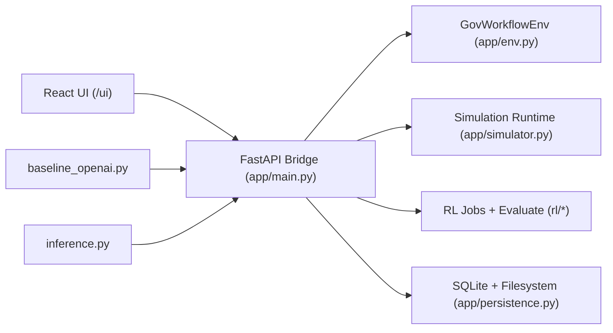
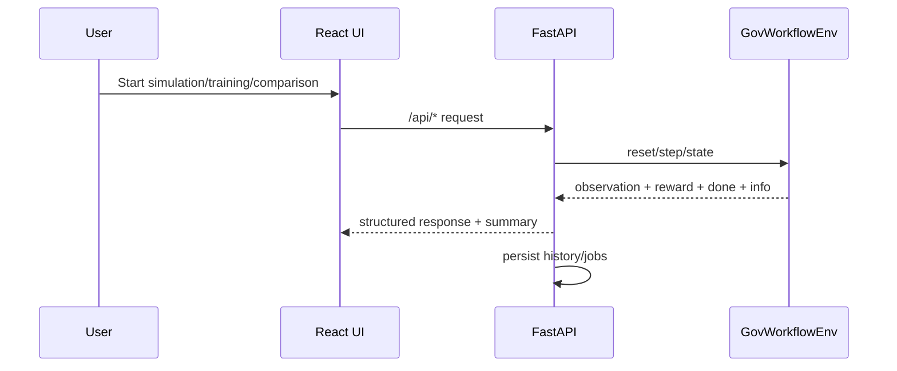

# Gov Workflow OpenEnv

Real-world OpenEnv environment for government-service workflow optimization, with a full FastAPI bridge, RL training stack, and React operations UI.

## Deployment Branch Note

The code currently deployed on Hugging Face Space is from branch `v2`.
The deployed version reflects the branch state of `v2`.

## Project Live Link

Project live on: https://huggingface.co/spaces/Abhayshinde/OPENENV_RL_08_04

## Pre-Submission Validation

The project was validated against the required submission checks.

| Check | Command / Endpoint | Result | Status |
|---|---|---|---|
| HF Space live check | POST https://huggingface.co/spaces/Abhayshinde/OPENENV_RL_08_04| HTTP 200 | Passed |
| OpenEnv validation | openenv validate | [OK] OPENENV_RL: Ready for multi-mode deployment | Passed |
| Docker build | docker build . | Building 528.4s (29/29) FINISHED | Passed |

All three core pre-submission checks passed successfully.

## Problem Statement

District and public-service offices process high-volume citizen requests such as birth certificates, income certificates, driving licenses, passports, GST registrations, caste certificates, and land registrations. In practice, delays are often not caused by one hard technical subproblem, but by day-to-day operational decisions:

- which queue should be prioritized first
- where limited officers should be allocated
- when missing documents should be requested
- when escalation budget should be used
- how to reduce backlog without creating unfair service imbalance

This project turns that real administrative workflow into an agent environment. The goal is not to play a game, but to train and evaluate agents on a genuine human workflow problem: reducing avoidable administrative delay while respecting fairness and SLA constraints.

## Solution Overview

The solution is a typed OpenEnv-compatible environment for government workflow control.

- `app/env.py` implements the core environment kernel
- `app/models.py` defines typed observation, action, reward, and state models
- `app/graders.py` defines deterministic task graders with bounded scores in `[0.0, 1.0]`
- `app/reward.py` provides dense reward shaping over the full trajectory
- `app/main.py` exposes the environment through FastAPI endpoints and serves the frontend UI
- `baseline_openai.py` and `inference.py` provide baseline and submission-style execution paths

Agents interact with the environment using operational actions such as changing priority mode, assigning or reallocating officers, requesting missing documents, escalating services, and advancing time. The environment tracks queue health, completions, SLA breaches, fairness, escalation usage, and invalid actions at every step.

## Environment Description and Motivation

This project simulates a real administrative workload that humans perform in district/public-service offices:

- queue prioritization
- officer allocation and reallocation
- missing document follow-up
- escalation budget management
- SLA/fairness balancing

Agents interact through OpenEnv-style APIs (`reset / step / state / grade`) and can be evaluated with deterministic graders.

The motivation is to provide a benchmark that reflects a real service-operations problem rather than a synthetic control task. It is useful for evaluating whether an agent can make sequential workflow decisions under practical constraints.

## Current Module Architecture





## OpenEnv Compliance

OpenEnv manifest:

- `openenv.yaml`

Typed Pydantic models (core contract):

- `ActionModel`
- `ObservationModel`
- `RewardModel`
- `StepInfoModel`
- `EpisodeStateModel`

Files:

- `app/models.py`
- `app/env.py`
- `app/main.py`

Environment endpoints:

- `POST /reset`
- `POST /step`
- `GET /state`
- `POST /state`
- `POST /grade`

Structured API aliases (non-breaking, same handlers):

- `POST /api/reset` and `POST /api/v1/reset`
- `POST /api/step` and `POST /api/v1/step`
- `POST /api/state` and `POST /api/v1/state`
- `POST /api/grade` and `POST /api/v1/grade`

Validation:

```bash
openenv validate
```

## Tasks, Difficulty, and Grading

Task definitions: `app/tasks.py`

1. `district_backlog_easy`
2. `mixed_urgency_medium`
3. `cross_department_hard`

Graders: `app/graders.py`

- deterministic
- score in `[0.0, 1.0]`
- per-task weighted criteria

### Task Descriptions with Expected Difficulty

#### 1. `district_backlog_easy`

Expected difficulty: Easy

- small district office
- 3 services
- lower arrival rate
- larger SLA windows
- lower missing-document and field-verification pressure

Primary challenge:
- basic queue prioritization
- straightforward backlog reduction
- simple document follow-up and staffing decisions

#### 2. `mixed_urgency_medium`

Expected difficulty: Medium

- 4 services
- higher arrival rate
- mixed urgency
- tighter fairness requirement
- more document rework and verification pressure

Primary challenge:
- balancing urgency, throughput, and fairness
- deciding when to request documents versus simply advancing time
- reallocating limited officer capacity without starving lower-volume queues

#### 3. `cross_department_hard`

Expected difficulty: Hard

- 5 services
- highest arrival rate
- stricter fairness threshold
- larger operational surface area
- more verification and coordination pressure

Primary challenge:
- managing a cross-department backlog over a longer horizon
- preserving fairness across services while still maximizing completions
- spending escalation budget and officer capacity carefully under sustained pressure

## Feature Modules (UI + Backend)

### 1) Overview Module

- shows environment purpose, workflow, tasks, and available system components
- frontend: `frontend/react/src/modules/OverviewModule.jsx`

### 2) Simulation Lab

- runs baseline / llm_inference / trained_rl simulations
- live step-by-step logs and metrics cards
- trajectory charts (reward/backlog, cumulative reward)
- LLM runtime guardrails:
  - stricter schema prompting
  - runtime action mask + repair bias
  - adaptive model fallback ranking
  - auto-recovery switching on repeated failure pattern
- history load/clear support
- frontend: `frontend/react/src/modules/SimulationModule.jsx`
- backend: `app/simulator.py`, `app/main.py`

### 3) Training Studio

- starts/stops background RL training jobs
- tracks progress/logs/evaluation rows
- unique model artifact naming per run
- persisted job history
- frontend: `frontend/react/src/modules/TrainingModule.jsx`
- backend: `app/training_jobs.py`, `app/main.py`, `app/persistence.py`

### 4) Model Comparison

- compares:
  - rule-based baseline policy
  - trained RL checkpoint
  - optional LLM simulation mode
- multi-seed configuration support (5–10)
- history load/clear support
- legacy comparison snapshot repair path:
  - old score-only history can be repaired to include run-level rows
- frontend: `frontend/react/src/modules/ComparisonModule.jsx`
- backend: `app/main.py`, `app/persistence.py`, `app/simulator.py`

## Action and Observation Spaces

### API Action Space (`ActionModel`)

- `set_priority_mode`
  - switches scheduling strategy among `urgent_first`, `oldest_first`, `balanced`, and `backlog_clearance`
- `assign_capacity`
  - assigns reserve officers to a service
- `request_missing_documents`
  - triggers document recovery for cases missing required documents in a service queue
- `escalate_service`
  - escalates service handling for a case/service path
- `advance_time`
  - processes one environment tick and advances the workflow
- `reallocate_officers`
  - moves officer capacity from one service to another

### API Observation Space (`ObservationModel`)

- `task_id`
- `day`, `max_days`
- `priority_mode`
- `officer_pool`
  - per-service allocations and reserve officers
- `queue_snapshots`
  - service-level queue state including stage counts, active cases, missing-docs cases, urgent cases, breached cases, and average age
- `total_backlog`
- `total_completed`
- `total_sla_breaches`
- `fairness_gap`
- `escalation_budget_remaining`
- `last_action_valid`
- `last_action_message`

### RL Wrapper Space

- Discrete 28 actions (intentionally retained)
- flat feature vector from engineered observations
- action masking enabled

Files:

- `rl/feature_builder.py`
- `rl/action_mask.py`
- `rl/gym_wrapper.py`

## Reward Design

Implemented in `app/reward.py` with dense trajectory signal:

- positive:
  - stage progress reward
  - completion reward
- penalties:
  - waiting/backlog pressure
  - new SLA breaches
  - fairness excess beyond threshold
  - invalid actions
  - idle officer capacity

This reward is meaningful over the full episode, not just at the end. Agents receive credit for partial operational progress and are penalized for obviously undesirable behavior.

## Baseline and Inference Programs

### `baseline_openai.py`

- CLI baseline/LLM runner (OpenAI-compatible + NVIDIA fallback support)

### `inference.py`

- submission-style inference script
- emits strict structured logs:
  - `[START]`
  - `[STEP]`
  - `[END]`

## Baseline Scores

The following baseline scores were produced by running the current root `inference.py` on this working codebase:

```bash
python inference.py
```

Observed results:

| Task | Steps | Score | Success |
|---|---:|---:|---|
| `district_backlog_easy` | 33 | `0.67` | `true` |
| `mixed_urgency_medium` | 61 | `0.59` | `true` |
| `cross_department_hard` | 80 | `0.65` | `true` |

These scores come from an actual run on the current project state, not placeholders.

Reproducibility notes:

- task seeds are fixed in `app/tasks.py` (`11`, `22`, `33`)
- the heuristic policy baseline in `app/baselines.py` is deterministic for the same seed
- reproducibility is also covered by `tests/test_baseline_repro.py`

## Repository Layout

```text
app/
  main.py              FastAPI API + route contracts
  env.py               GovWorkflowEnv kernel
  models.py            Typed schemas
  tasks.py             Task configs
  reward.py            Reward shaping
  graders.py           Deterministic graders
  simulator.py         Baseline/LLM/trained simulation runtime
  training_jobs.py     Background RL training manager
  persistence.py       SQLite/filesystem persistence
  baselines.py         Rule-based baseline policies
rl/
  feature_builder.py   RL feature engineering
  action_mask.py       Action validity mask
  gym_wrapper.py       Gym wrapper for RL algorithms
  train_ppo.py         Phase training entrypoint
  evaluate.py          Checkpoint evaluator
frontend/react/
  src/
    modules/           Overview, Simulation, Training, Comparison
    components/        Layout + charts
openenv.yaml           OpenEnv manifest
baseline_openai.py     Baseline/LLM CLI runner
inference.py           Submission runner
Dockerfile             Deployment image
```

## Local Setup

### Prerequisites

- Python 3.11+
- Node 20+
- Docker Desktop

### Install

```bash
pip install -r requirements.txt
pip install -r requirements_rl.txt
npm --prefix frontend/react install
```

### Environment

```bash
copy .env.example .env
```

Fill required keys depending on chosen provider:

- `API_BASE_URL`
- `MODEL_NAME`
- `HF_TOKEN` or `OPENAI_API_KEY`/`API_KEY`
- optional NVIDIA keys:
  - `NVIDIA_API_KEY`
  - `NVIDIA_API_KEY_2`

Optional gateway transport keys (for `inference.py` / `baseline_openai.py`):

- `OPENENV_ENV_TRANSPORT` = `auto` | `http` | `direct`
- `OPENENV_ENV_BASE_URL` = FastAPI host, for example `http://127.0.0.1:7860`
- `OPENENV_ENV_API_PREFIX` = `""` or `/api` or `/api/v1`
- `OPENENV_ENV_API_PREFIX_CANDIDATES` = comma-separated probe order (optional)
- `FORCE_FASTAPI_GATEWAY` = `1` to block direct fallback

### Run (recommended)

Terminal 1:

```bash
python scripts/run_local.py --host 127.0.0.1 --port 7860 --reload
```

Terminal 2:

```bash
npm --prefix frontend/react run dev
```

Open:

- UI: `http://127.0.0.1:5173/ui`
- API docs: `http://127.0.0.1:7860/docs`

### Run baseline inference

```bash
python inference.py
```

### Run heuristic policy baseline directly

```bash
python baseline_openai.py --agent heuristic --task all --verbose
```

## Local Validation and Test Commands

```bash
openenv validate
python -m pytest tests/test_api.py -q
python -m pytest tests/test_gym_wrapper.py tests/test_action_mask.py tests/test_curriculum.py -q
python -m pytest tests/test_persistence_history.py tests/test_simulator_guardrails.py -q
```

## Docker Build and End-to-End Run

### Build image

```bash
docker build -t openenv-rl:local .
```

### Run container

```bash
docker rm -f openenv-rl-test 2>nul
docker run -d --name openenv-rl-test -p 7860:7860 --env-file .env openenv-rl:local
```

Open:

- UI: `http://127.0.0.1:7860/ui`
- Health: `http://127.0.0.1:7860/health`
- Docs: `http://127.0.0.1:7860/docs`

### Run with persistent volume (recommended)

```bash
docker rm -f openenv-rl-test 2>nul
docker run -d --name openenv-rl-test ^
  -p 7860:7860 ^
  --env-file .env ^
  -e STORAGE_ENABLED=true ^
  -e OPENENV_DATA_DIR=/data/openenv_rl ^
  -v %cd%/data:/data ^
  openenv-rl:local
```

## Hugging Face Spaces (Docker SDK)

This README includes the required Spaces YAML metadata header at top.

Deployment checklist:

1. Create Space with `SDK = Docker`.
2. Push repository with root `Dockerfile`.
3. Add required Secrets/Variables:
   - `API_BASE_URL`
   - `MODEL_NAME`
   - `HF_TOKEN` (or provider keys)
   - `STORAGE_ENABLED=true`
   - `OPENENV_DATA_DIR=/data/openenv_rl`
4. Enable persistent storage on Space.
5. Verify:
   - `/health` returns 200
   - `/reset` works
   - `openenv validate` passes

## License

BSD-3-Clause.

## Team Mate

https://github.com/AbhayShinde16325
