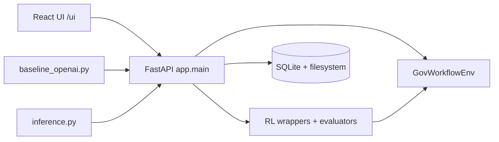
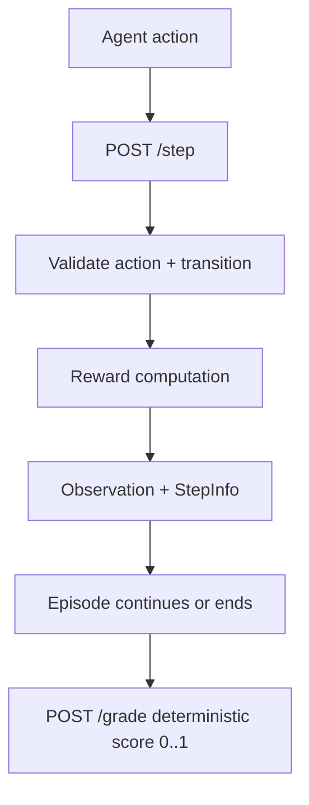

# Gov Workflow OpenEnv

Real-world OpenEnv environment for government-service workflow optimization.

This project implements an OpenEnv-style environment where agents learn through the standard `reset()` / `step()` / `state()` API, and are graded deterministically across three task difficulties.

## What This Project Solves
District offices handle high-volume citizen applications (passport, birth certificate, income certificate, GST, etc.). Delay is often caused by operational choices:
- queue prioritization
- missing-document recovery
- staffing allocation across services
- escalation discipline
- fairness balancing across service categories

This environment simulates that operational layer so we can train/evaluate agents on a real-world workflow task (not a game).

## Current Progress (As Of 2026-04-08)
- OpenEnv-compatible environment implemented with typed Pydantic models.
- 3 tasks implemented: easy, medium, hard.
- Deterministic graders implemented and tested (`score` in `[0.0, 1.0]`).
- Dense reward shaping with partial progress + penalties implemented.
- Baseline runner (`baseline_openai.py`) available.
- Submission-style inference runner (`inference.py`) available with strict `[START]/[STEP]/[END]` logging.
- RL pipeline implemented:
  - Phase 1 Maskable PPO (28-action design)
  - Phase 2 curriculum PPO
  - Phase 3 recurrent PPO implemented but currently underperforming vs Phase 2
- Frontend modules implemented: Overview, Simulation Lab, Training Studio, Model Comparison.
- FastAPI is the orchestration bridge for simulation/training/comparison workflows.
- Persistence layer implemented (SQLite + filesystem).
- Docker image builds successfully and serves `/ui` + API.
- `openenv validate` passes.

## Repository Architecture





## OpenEnv Compliance
Manifest:
- `openenv.yaml`

Core typed models:
- `app/models.py`
  - `ActionModel`
  - `ObservationModel`
  - `RewardModel`
  - `EpisodeStateModel`
  - `StepInfoModel`

Environment kernel:
- `app/env.py`

FastAPI bridge:
- `app/main.py`

OpenEnv API shape available:
- `POST /reset`
- `POST /step`
- `GET /state`
- `POST /state`
- `POST /grade`

Validation command:
```bash
openenv validate
```

## Task Set and Difficulty
Defined in `app/tasks.py`:
- `district_backlog_easy`
- `mixed_urgency_medium`
- `cross_department_hard`

Graders in `app/graders.py`:
- deterministic scoring
- bounded `[0, 1]`
- task-specific criteria weighting

## Action and Observation Spaces
### API Action Space (typed)
`ActionModel` supports:
- `set_priority_mode`
- `assign_capacity`
- `request_missing_documents`
- `escalate_service`
- `advance_time`
- `reallocate_officers`

### API Observation Space (typed)
`ObservationModel` includes:
- day/max_day
- priority mode
- officer allocations + reserve
- per-service queue snapshots (active, urgent, missing docs, breached, age)
- totals (backlog/completed/SLA breaches/fairness)
- escalation budget remaining
- last action validity/error context

### RL Wrapper Spaces
- Discrete action space: 28 actions (kept intentionally)
- Flattened observation vector: 84 float features
- Action masking implemented

Files:
- `rl/feature_builder.py`
- `rl/action_mask.py`
- `rl/gym_wrapper.py`

## Reward Design
Implemented in `app/reward.py`.

Positive components:
- progress reward
- completion reward

Penalty components:
- waiting/backlog pressure
- SLA breaches
- fairness excess
- invalid actions
- idle capacity

This gives trajectory-level signal, not just terminal binary reward.

## RL Training Status
### Phase 1
- Maskable PPO on easy task

### Phase 2
- Curriculum PPO across easy/medium/hard
- Current best practical checkpoint family in this repo

### Phase 3
- Recurrent PPO implemented
- Currently underperforming vs Phase 2 in observed runs
- Expansion paused for now per project decision

Useful commands:
```bash
python -m rl.train_ppo --phase 1 --timesteps 200000 --n-envs 4 --seed 42
python -m rl.train_ppo --phase 2 --timesteps 500000 --n-envs 4 --seed 42 --phase2-config rl/configs/curriculum.yaml
python -m rl.evaluate --model results/best_model/phase2_final.zip --episodes 3 --model-type maskable
```

## Baseline and Inference Runners
### baseline_openai.py
Purpose:
- CLI baseline runner for heuristic/LLM policy execution.
- Supports OpenAI-compatible and NVIDIA-style routing/fallback behavior.

Example:
```bash
python baseline_openai.py --agent heuristic --task all --verbose
python baseline_openai.py --agent llm --task district_backlog_easy --verbose
```

### inference.py
Purpose:
- Submission-style inference runner with strict stdout format:
  - `[START]`
  - `[STEP]`
  - `[END]`

Example:
```bash
python inference.py
```

Environment variables expected by inference flow:
- `API_BASE_URL`
- `MODEL_NAME`
- `HF_TOKEN` (or compatible key)
- fallback-compatible: `OPENAI_API_KEY`, `API_KEY`, `NVIDIA_API_KEY`, `NVIDIA_API_KEY_2`

## Frontend Modules
- Overview
- Simulation Lab
- Training Studio
- Model Comparison

Design direction:
- backend-driven workflows through FastAPI APIs
- minimal required user inputs
- dynamic logs, metrics, and run summaries

## Persistence and Progress Retention
Implemented in `app/persistence.py`.

Stores:
- simulation history
- comparison history
- training jobs metadata
- training artifacts

Runtime controls:
- `STORAGE_ENABLED=true`
- `OPENENV_DATA_DIR=/data/openenv_rl` (recommended for deployment)

Important:
- persistence survives refresh/restart only if runtime disk is persistent (for example mounted `/data` volume).

## Local Development Setup
## Prerequisites
- Python 3.11+
- Node 20+
- Docker Desktop (for container run)

## Install dependencies
```bash
pip install -r requirements.txt
pip install -r requirements_rl.txt
npm --prefix frontend/react install
```

## Configure environment
```bash
copy .env.example .env
```

Fill key fields as needed (`NVIDIA_API_KEY`, `HF_TOKEN`, etc).

## Run locally (backend + built UI)
```bash
npm --prefix frontend/react run build
python scripts/run_local.py --host 0.0.0.0 --port 7860
```

Open:
- UI: `http://127.0.0.1:7860/ui`
- Docs: `http://127.0.0.1:7860/docs`

## Run split dev mode (for frontend edits)
Terminal 1:
```bash
python scripts/run_local.py --host 127.0.0.1 --port 7860 --reload
```

Terminal 2:
```bash
npm --prefix frontend/react run dev
```

Open:
- UI: `http://127.0.0.1:5173/ui`

## Docker Build and Run (Verified)
## Build image
```bash
docker build -t openenv-rl:local .
```

## Run container
```bash
docker rm -f openenv-rl-test 2>nul
docker run -d --name openenv-rl-test -p 7860:7860 --env-file .env openenv-rl:local
```

Open:
- UI: `http://127.0.0.1:7860/ui`
- Docs: `http://127.0.0.1:7860/docs`
- Health: `http://127.0.0.1:7860/health`

## Optional persistent volume for local Docker
```bash
docker rm -f openenv-rl-test 2>nul
docker run -d --name openenv-rl-test \
  -p 7860:7860 \
  --env-file .env \
  -e STORAGE_ENABLED=true \
  -e OPENENV_DATA_DIR=/data/openenv_rl \
  -v %cd%/data:/data \
  openenv-rl:local
```

## Hugging Face Docker Deployment
1. Create Space with SDK = Docker.
2. Keep app port at `7860`.
3. Add Secrets/Variables:
   - `API_BASE_URL`
   - `MODEL_NAME`
   - `HF_TOKEN` (or alternate provider keys)
   - `STORAGE_ENABLED=true`
   - `OPENENV_DATA_DIR=/data/openenv_rl`
4. Enable persistent storage in Space settings.
5. Push repository (with `Dockerfile` at root).

## API Quick Smoke Tests
```bash
curl http://127.0.0.1:7860/health
curl http://127.0.0.1:7860/api/tasks
curl http://127.0.0.1:7860/api/agents
```

Simulation run test:
```bash
curl -X POST http://127.0.0.1:7860/api/simulation/run \
  -H "Content-Type: application/json" \
  -d "{\"task_id\":\"district_backlog_easy\",\"agent_mode\":\"baseline_policy\",\"policy_name\":\"backlog_clearance\",\"max_steps\":20,\"seed\":42}"
```

## Validation and Tests
```bash
openenv validate
python -m pytest tests/test_api.py -q
python -m pytest tests/test_gym_wrapper.py tests/test_action_mask.py tests/test_curriculum.py -q
python -m pytest tests/test_persistence_history.py tests/test_simulator_guardrails.py -q
```

## Known Operational Notes
- If UI shows old JS bundle errors after updates, rebuild image and hard refresh browser.
- If history disappears after restart, ensure persistent storage is mounted and `OPENENV_DATA_DIR` points to that mount.
- For local no-key mode, simulation falls back to heuristic policy.

## Key Directories
```text
app/
  main.py              FastAPI app and API routes
  env.py               GovWorkflowEnv kernel
  models.py            Typed schemas
  tasks.py             Task definitions
  graders.py           Deterministic graders
  reward.py            Reward shaping
  simulator.py         Simulation bridge (baseline/llm/trained)
  training_jobs.py     Background RL training jobs
  persistence.py       SQLite + artifact persistence
rl/
  feature_builder.py   RL feature engineering
  action_mask.py       Action mask logic
  gym_wrapper.py       Gymnasium wrapper
  train_ppo.py         PPO training
  evaluate.py          RL evaluation
frontend/react/
  src/                 React modules and components
openenv.yaml           OpenEnv manifest
inference.py           Submission-style inference runner
baseline_openai.py     Baseline runner
Dockerfile             Deployment image
```

## License
BSD-3-Clause.
