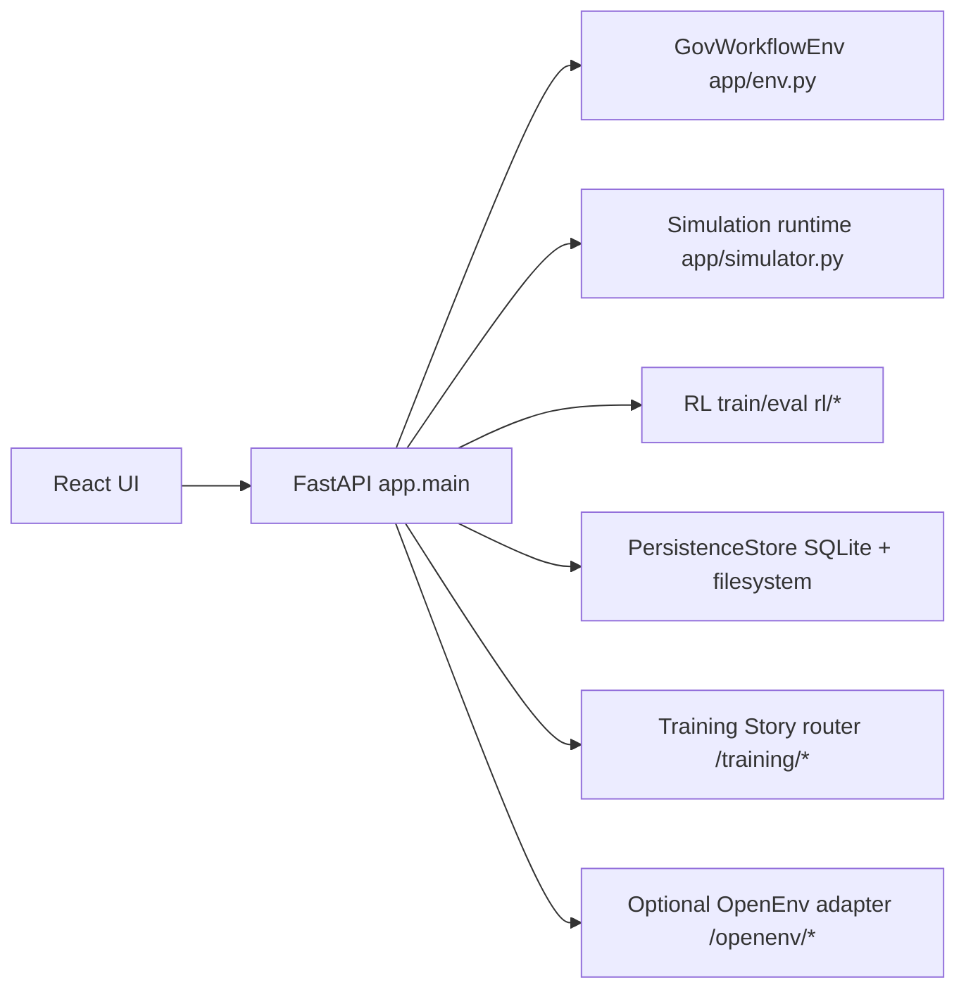

---
title: Gov Workflow OpenEnv
sdk: docker
app_port: 7860
pinned: false
---

# Gov Workflow OpenEnv

## Quick Links

- Hugging Face Space URL (Dummy, update later): [https://huggingface.co/spaces/your-username/your-space-name](https://huggingface.co/spaces/your-username/your-space-name)  
  This placeholder will be replaced with the final deployed demo link.
- Blog path in codebase: `OPENENV_RL/Blog.md`  
  Project write-up and narrative documentation for design choices and outcomes.
- Notebook path: `OPENENV_RL/GovWorkflow_RL_ENV.ipynb`  
  Main OpenEnv RL government workflow notebook used as the judge-facing criteria book. It contains the practical judging context, environment setup, and the full end-to-end flow in one place.
- Notebook Colab URL: [https://colab.research.google.com/drive/1ssTnxKoU1nOfSNA3nOeiNM8S4fKFpkby?usp=sharing](https://colab.research.google.com/drive/1ssTnxKoU1nOfSNA3nOeiNM8S4fKFpkby?usp=sharing)  
  Cloud version of the same notebook so judges can run and review the complete workflow without local setup.
- GRPO Phase 1 training link: [https://colab.research.google.com/drive/1ND_DZ6xcT2JuH7uGB2AYbiZ1dcHKFfIw?usp=sharing](https://colab.research.google.com/drive/1ND_DZ6xcT2JuH7uGB2AYbiZ1dcHKFfIw?usp=sharing)  
  First-stage GRPO training run where the LLM agent starts learning policy behavior inside the RL environment.
- GRPO Phase 2 training link: [https://colab.research.google.com/drive/1ofxEADct_gTX5DGhcnk8lW6p31gFCIFV?usp=sharing](https://colab.research.google.com/drive/1ofxEADct_gTX5DGhcnk8lW6p31gFCIFV?usp=sharing)  
  Second-stage GRPO continuation where the same LLM agent is further trained and refined on the RL environment.
- PPO Phase 1 training (local): `rl/train_ppo.py`  
  Phase 1 PPO baseline training was executed on the local system to establish the RL algorithm baseline before phase-2 progression.
- PPO Phase 2 training link: [https://colab.research.google.com/drive/1RVXQs-QAuXLBw0YXJtN4cbEootCTfHO7?usp=sharing](https://colab.research.google.com/drive/1RVXQs-QAuXLBw0YXJtN4cbEootCTfHO7?usp=sharing)  
  PPO phase 2 training notebook where the RL algorithm is further trained on the same environment for improved policy performance.

Gov Workflow OpenEnv is a FastAPI-first simulation environment for public service workflow operations.
It models queue prioritization, officer allocation, missing-document recovery, escalation usage, and fairness-aware SLA management across government services.

This repository is productionized for:
- local development (FastAPI + Vite)
- Docker runtime
- Hugging Face Spaces (Docker SDK)

## Current Main-Branch Status

This README is aligned to the current `main` branch code paths, including:
- `app.main:app` as primary server runtime
- React UI served at `/ui` from built Vite assets when available
- OpenEnv contract endpoints (`/reset`, `/step`, `/state`, `/grade`)
- frontend API aliases (`/api/*`) and versioned aliases (`/api/v1/*`)
- training story endpoints (`/training/*`)
- simulation, RL, persistence, compliance, and history endpoints

## End-to-End Architecture



## Core Runtime Components

- API server: `app/main.py`
- Environment kernel: `app/env.py`
- Typed models: `app/models.py`
- Task registry: `app/tasks.py`
- Reward shaping: `app/reward.py`
- Deterministic graders: `app/graders.py`
- Simulation runtime: `app/simulator.py`
- Training jobs manager: `app/training_jobs.py`
- Persistence layer: `app/persistence.py`
- Transport gateway: `app/api_gateway.py`
- React frontend: `frontend/react`

## Task Set (Current Runtime)

Configured in `app/tasks.py`:
- `district_backlog_easy`
- `mixed_urgency_medium`
- `cross_department_hard`
- `district_backlog_easy_extreme`

Benchmark list used by APIs:
- `district_backlog_easy`
- `mixed_urgency_medium`
- `cross_department_hard`

## Service Coverage

`ServiceType` includes:
- `passport`
- `driving_license`
- `aadhaar_card`
- `gst_registration`
- `income_certificate`
- `caste_certificate`
- `birth_certificate`
- `land_registration`

Medium and hard tasks currently run with:
- `income_certificate`
- `land_registration`
- `passport`
- `driving_license`
- `aadhaar_card`


## Local Development

### Prerequisites

- Python 3.11+
- Node 20+
- Docker

### Install dependencies

```bash
pip install -r requirements.txt
pip install -r requirements_rl.txt
pip install pytest pytest-asyncio
npm --prefix frontend/react install
```

### Configure environment

```bash
copy .env.example .env
```

Populate as needed:
- `API_BASE_URL`
- `MODEL_NAME`
- `HF_TOKEN` or `OPENAI_API_KEY`/`API_KEY`
- optional NVIDIA keys (`NVIDIA_API_KEY`, `NVIDIA_API_KEY_2`)
- storage settings (`STORAGE_ENABLED`, `OPENENV_DATA_DIR`)

### Run backend

```bash
python scripts/run_local.py --host 127.0.0.1 --port 7860 --reload
```

### Run frontend

```bash
npm --prefix frontend/react run dev
```

Open:
- UI: `http://127.0.0.1:5173/ui`
- API docs: `http://127.0.0.1:7860/docs`


## Repository Layout

```text
app/
  main.py               FastAPI app + API routing + compatibility aliases
  env.py                GovWorkflowEnv kernel
  models.py             Typed Pydantic contracts
  tasks.py              Runtime task registry
  reward.py             Reward shaping
  graders.py            Deterministic graders
  simulator.py          Simulation runtime and live sessions
  training_jobs.py      Background RL training manager
  persistence.py        SQLite/filesystem persistence
  api_gateway.py        direct/http/auto environment transport layer
  story_router.py       training story endpoints
rl/
  gov_workflow_env.py   Gym adapter
  train_ppo.py          PPO phase training entrypoint
  evaluate.py           Checkpoint evaluator
  feature_builder.py    RL feature engineering
  action_mask.py        Action mask logic
frontend/react/
  src/                  React modules/components/api hooks
scripts/
  run_local.py          Local FastAPI launcher
  convert_grpo_csv.py   Training CSV to JSON converter for story endpoints
openenv.yaml            OpenEnv manifest metadata
baseline_openai.py      Baseline and LLM runner
inference.py            Submission-style inference runner
Dockerfile              Docker image definition
```

## License

BSD-3-Clause
